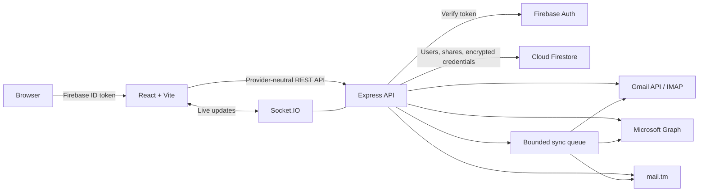

<div align="center">
  
  <h1>OmniMail</h1>
  <p><strong>Every inbox. One signal.</strong></p>
  <p>A focused workspace for Gmail, Outlook and temporary email—with secure sharing and role-based access.</p>

  <p>
    <a href="https://omnimail.io.vn"><strong>Live demo</strong></a>
    ·
    <a href="https://omnimail-api.onrender.com/api/health">API health</a>
    ·
    <a href="#run-locally">Run locally</a>
  </p>

  <p>
    
    
    
    
    
  </p>
</div>

---

## Overview

OmniMail brings multiple email providers into one provider-neutral interface. The browser never talks directly to Gmail, Microsoft Graph, IMAP or mail.tm. A guarded API owns provider credentials, normalizes messages and enforces mailbox ownership before returning data to the client.

The project is a production-oriented TypeScript monorepo. It includes a responsive React application, an Express API, Firebase authentication and persistent encrypted mailbox connections.

### Why OmniMail?

- **One reading workflow** for Gmail, Outlook and disposable inboxes.
- **Ten-message focus** keeps the inbox useful without loading an entire mailbox.
- **Lazy message bodies** reduce provider calls and initial response size.
- **Real mailbox synchronization** runs provider reads through a bounded background queue and exposes job status.
- **Secure mailbox sharing** lets Premium users receive read-only access.
- **Clear access levels** separate Basic, Premium and Admin capabilities.
- **Mobile-first editorial UI** works across phone, tablet and desktop layouts.

Shared mailbox addresses are never listed globally. A recipient must search with the correct first five characters before a shared mailbox is revealed. Microsoft refresh-token connections remain available for managed Premium sharing workflows; share-triggered sync jobs are prioritized to warm the mailbox cache immediately.

## Try the demo

Open **[omnimail.io.vn](https://omnimail.io.vn)** and create an account with email/password or a supported social provider.

1. Open **Connect**.
2. Connect Gmail or Microsoft through OAuth, or use a supported app-password/refresh-token flow.
3. Open **Temp Mail** to create a disposable address without provider configuration.
4. Visit **Mailboxes** to read the ten newest messages and refresh the active inbox.
5. Admin accounts can manage roles and share owned mailboxes with Premium users.

> The API currently runs on a free Render instance. After a long idle period, the first request can take longer while the service wakes up. OmniMail starts warming the API from the login page and shows service status instead of an empty mailbox state.

## Main features

| Area | What is included |
| --- | --- |
| Unified inbox | Gmail, Microsoft/Outlook and temp-mail accounts behind shared DTOs |
| Mail reading | Latest 10 messages, lazy body loading, provider refresh and automatic polling |
| Synchronization | Provider-backed jobs, short-lived message cache, scheduled refresh and live Socket.IO updates |
| Account connection | Google OAuth, Microsoft OAuth, Gmail app password and Microsoft refresh-token import |
| Temporary email | mail.tm domain discovery, address creation, copy, refresh and deletion |
| Authentication | Firebase email/password plus Google, Facebook and Microsoft sign-in |
| Access control | Basic, Premium and Admin roles with server-side authorization |
| Mailbox sharing | Owner-controlled read-only sharing and recipient revocation |
| Administration | User directory, role management, mailbox overview and service status |
| Security | Encrypted credentials, signed OAuth state, ownership checks, rate limits and redacted logs |
| UX | Responsive layouts, loading/error states, subtle motion and reduced-motion support |

## Architecture



### Request flow

1. Firebase authenticates the user and issues an ID token.
2. The web client sends that token with every protected API request.
3. The API verifies identity, role, mailbox ownership and sharing permissions.
4. A provider adapter fetches the requested data.
5. Provider-specific responses are normalized into shared `MailAccount` and `MailMessage` types.
6. Credentials remain server-side and are encrypted before Firestore persistence.
7. Manual, scheduled and share-triggered sync jobs refresh provider data and notify authorized viewers live.

## Tech stack

| Layer | Technology |
| --- | --- |
| Web | React 19, Vite, TypeScript, React Router |
| Client state | TanStack Query, Zustand |
| API | Node.js 22, Express 5, Socket.IO, Zod |
| Authentication | Firebase Authentication and Firebase Admin |
| Persistence | Cloud Firestore and Firebase Storage rules |
| Mail providers | Gmail API, Microsoft Graph, ImapFlow, mail.tm |
| Security | Helmet, CORS allowlist, rate limiting, AES-256-GCM credential encryption |
| Testing | Vitest, Supertest, Firebase Emulator Suite |
| Delivery | Firebase Hosting, Render Docker service |

## Repository layout

```text
omnimail/
├── apps/
│   ├── web/                 # React application and responsive UI
│   └── api/                 # Express API and mail-provider adapters
├── packages/
│   ├── shared/              # Provider-independent DTOs and contracts
│   └── ui/                  # Reusable UI package surface
├── firebase/                # Firestore and Storage security rules
├── docker-compose.yml       # Local API and future shared-queue baseline
├── firebase.json            # Hosting, rules and emulator configuration
└── render.yaml              # Production API blueprint
```

## Run locally

### Requirements

- Node.js 22+
- pnpm 10+
- A Firebase project, or the Firebase Emulator Suite for local development

### Install and start

```bash
git clone https://github.com/NguyenHuuHung-Dev/ommimail.git
cd ommimail
pnpm install
pnpm dev
```

| Service | Local URL |
| --- | --- |
| Web app | `http://localhost:5173` |
| API | `http://localhost:4000` |
| API health | `http://localhost:4000/api/health` |

Run either application independently when needed:

```bash
pnpm dev:web
pnpm dev:api
```

## Environment configuration

The web and API use separate environment files. Never expose provider secrets through a `VITE_*` variable.

### Web — `apps/web/.env`

```dotenv
VITE_API_BASE_URL=http://localhost:4000
VITE_FIREBASE_API_KEY=
VITE_FIREBASE_AUTH_DOMAIN=
VITE_FIREBASE_PROJECT_ID=
VITE_FIREBASE_STORAGE_BUCKET=
VITE_FIREBASE_MESSAGING_SENDER_ID=
VITE_FIREBASE_APP_ID=
```

### API — `apps/api/.env`

Start from [`.env.example`](.env.example). The production-critical settings are:

```dotenv
NODE_ENV=development
PORT=4000
WEB_APP_URL=http://localhost:5173
SOCKET_CORS_ORIGIN=http://localhost:5173
DEMO_MODE=false

FIREBASE_PROJECT_ID=
FIREBASE_CLIENT_EMAIL=
FIREBASE_PRIVATE_KEY=
FIREBASE_STORAGE_BUCKET=

GOOGLE_CLIENT_ID=
GOOGLE_CLIENT_SECRET=
GOOGLE_REDIRECT_URI=http://localhost:4000/api/oauth/google/callback

MICROSOFT_CLIENT_ID=
MICROSOFT_CLIENT_SECRET=
MICROSOFT_TENANT_ID=common
MICROSOFT_REDIRECT_URI=http://localhost:4000/api/oauth/microsoft/callback

OAUTH_STATE_SECRET=
TOKEN_ENCRYPTION_KEY=
TOKEN_ENCRYPTION_KEY_VERSION=1
SYNC_CONCURRENCY=2
SYNC_INTERVAL_MS=300000
```

Generate a 32-byte encryption key:

```bash
node -e "console.log(require('node:crypto').randomBytes(32).toString('base64'))"
```

## Firebase setup

1. Enable Firebase Email/Password Authentication and the social providers you want to expose.
2. Create Cloud Firestore and a private Storage bucket.
3. Create an Admin SDK service account for the API.
4. Put the Firebase browser configuration in `apps/web/.env`.
5. Put the Admin SDK configuration and encryption key in `apps/api/.env`.
6. Deploy the checked-in security rules:

```bash
firebase deploy --only firestore:rules,storage
```

The rules intentionally prevent browser code from writing provider credentials, ownership data and synchronization cursors. Those operations belong to the authenticated API.

### Grant Admin access

```bash
pnpm --filter @omnimail/api admin:grant user@example.com
```

The affected user must sign out and sign in again to receive an updated Firebase custom claim.

## Provider configuration

<details>
<summary><strong>Google OAuth and Gmail</strong></summary>

1. Enable the Gmail API in Google Cloud.
2. Configure an OAuth consent screen.
3. Create a Web OAuth client.
4. Add `GOOGLE_REDIRECT_URI` as an authorized redirect URI.
5. Set the client ID, client secret and a long random `OAUTH_STATE_SECRET` on the API.

OAuth state is signed, short-lived and bound to the authenticated Firebase UID. Refresh credentials are stored only as encrypted server-side data.
</details>

<details>
<summary><strong>Microsoft OAuth</strong></summary>

1. Register an application in Microsoft Entra ID.
2. Use tenant `consumers` for personal Outlook accounts or `common` when the app supports both personal and organizational accounts.
3. Grant delegated `Mail.Read` and `offline_access` permissions.
4. Add `MICROSOFT_REDIRECT_URI` to the application registration.
5. Configure the client ID, client secret and tenant ID on the API.

Microsoft mail is read through Microsoft Graph. The legacy seeded IMAP path is disabled unless `ENABLE_LEGACY_MICROSOFT_SEED=true` is explicitly configured.
</details>

<details>
<summary><strong>Temporary mail</strong></summary>

Temporary addresses use mail.tm's account-token flow. No provider API key is required. Each generated mailbox receives its own bearer token, stored encrypted by the API.
</details>

## API highlights

| Method | Route | Purpose |
| --- | --- | --- |
| `GET` | `/api/health` | Runtime mode, persistence and provider readiness |
| `GET` | `/api/me` | Authenticated profile and role |
| `GET` | `/api/mail-accounts` | Owned or explicitly shared mailboxes |
| `GET` | `/api/messages` | Latest normalized messages for an accessible mailbox |
| `GET` | `/api/messages/:id` | Lazy-load one complete message |
| `POST` | `/api/mail-accounts/:id/sync` | Queue a real provider synchronization job |
| `GET` | `/api/sync-jobs/:id` | Read synchronization progress and result |
| `POST` | `/api/oauth/:provider/start` | Start a user-bound OAuth flow |
| `GET/PUT` | `/api/mailbox-shares` | View, grant or revoke mailbox access |
| `GET/POST` | `/api/temp-mail/*` | Discover domains and manage disposable inboxes |
| `GET` | `/api/admin/overview` | Admin-only user and mailbox directory |

All protected routes require a valid Firebase bearer token. Resource access is checked again on the server; hidden UI controls are never treated as authorization.

## Quality checks

```bash
pnpm build
pnpm typecheck
pnpm test
pnpm lint
```

Firestore and Storage rules can be tested through the Firebase emulators:

```bash
pnpm test:rules
```

## Deployment

### Web — Firebase Hosting

```bash
pnpm --filter @omnimail/web build
firebase deploy --only hosting
```

Set `VITE_API_BASE_URL` to the public API origin before building.

### API — Docker/Render

The included [`apps/api/Dockerfile`](apps/api/Dockerfile) builds the API from the monorepo. [`render.yaml`](render.yaml) defines the current production service, health check and required environment variables.

```bash
docker build -f apps/api/Dockerfile -t omnimail-api .
docker run --env-file apps/api/.env -p 4000:4000 omnimail-api
```

## Security notes

- Provider credentials are encrypted with AES-256-GCM before Firestore persistence.
- OAuth state is signed, expiring and tied to the current user.
- Firebase ID tokens are verified by the Admin SDK.
- Mailbox ownership and sharing permissions are enforced per API request.
- CORS and Socket.IO origins are allowlisted separately.
- API logs redact authorization headers and cookies.
- Firestore rules block browser-side credential and ownership mutations.
- Rate limiting and Helmet security headers are enabled globally.

## Current limitations and roadmap

- The UI intentionally shows the ten newest messages rather than a complete mailbox archive.
- The API currently targets a single runtime instance; horizontal scaling needs a shared synchronization layer.
- Synchronization jobs run in a bounded in-process queue; horizontal scaling will require a shared queue.
- Render's free instance can cold-start after inactivity.
- OmniMail is intentionally read-only and does not implement compose, reply, forward or email sending.

Planned improvements include provider webhooks, a durable shared queue, stronger end-to-end coverage and an always-on API deployment.

---

<div align="center">
  Built by <a href="https://github.com/NguyenHuuHung-Dev">NguyenHuuHung-Dev</a> as a focused, secure and provider-independent way to read every inbox.
</div>
